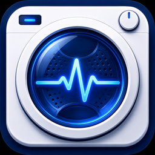

# ioBroker.laundrylens

Self-learning ioBroker adapter for automatic detection of washing machine and dryer cycles via smart plug power measurement. Recognizes running programs, estimates remaining time and sends Telegram notifications – fully local, no cloud.

> **Alpha release.** Tested on Siemens iQ washing machine and dryer. Other brands and models may require tuning. Feedback welcome.

---

## How it works

LaundryLens records the power consumption curve of each cycle and compares it against stored program profiles using segment-weighted correlation and a DTW-lite algorithm. Confidence is accumulated over multiple matching rounds before a program is accepted, which prevents single outliers from triggering a wrong match. Remaining time is estimated dynamically based on both elapsed time and the current energy rate – not just a fixed average.

The adapter is self-learning: there are no pre-built profiles. Every program is trained on your specific device. Recognition improves with each completed cycle.

---

## Features

- Cycle detection via state machine (OFF → STARTING → RUNNING ↔ PAUSED → ENDING)
- Self-learning program matching (segment-weighted correlation + DTW tiebreak)
- Score accumulation over multiple rounds with device-specific confidence thresholds
- Override lock: manually selected programs are not overwritten by background matching
- Adaptive remaining time estimation combining time-based and energy-rate signals
- Admin UI with expandable cycle list, inline power graph (canvas), phase legend, trim and split per touch/drag
- Telegram notifications with configurable update thresholds, placeholders (`{progress}`, `{prevTime}`) and conditional text blocks
- Also supports Pushover, Signal, WhatsApp, Matrix, notify-my-android, Prowl, and email (via [ioBroker.email](https://github.com/iobroker-community-adapters/ioBroker.email)) as notification targets
- Multiple devices: one instance per device (washing machine, dryer, …)

---

## Requirements

- ioBroker with js-controller ≥ 5.0.0
- Node.js ≥ 18
- A smart plug or power meter adapter providing a watt data point per device (e.g. Shelly EM)

---

## Installation

Install **LaundryLens** via the ioBroker Admin adapter list (tab "Adapters"), then create a separate adapter instance for each device and select the watt data point in the instance configuration.

---

## Configuration

Each instance has the following settings:

| Setting | Description |
|---|---|
| Device name | Display name for this device |
| Device type | `washing_machine` or `dryer` (affects phase detection logic) |
| Power sensor (W) | ioBroker data point providing watt values |
| Power threshold (W) | Minimum wattage to consider the device as running |
| Off delay (min) | Time to wait after power drops before ending the cycle |
| Start energy gate (Wh) | Minimum energy consumed before matching starts (filters short spikes) |
| Duration tolerance | Allowed deviation from learned average duration (0.05–0.5) |
| Matching interval (min) | How often matching runs during a cycle |
| Match confirmations | Number of consecutive rounds a match must hold before being accepted |
| Auto-confirm threshold (%) | Confidence at which a match is confirmed automatically |
| Instant-confirm threshold (%) | Confidence at which a match is accepted immediately (2 rounds in a row) |
| Program detection threshold (%) | Minimum confidence for a candidate to be considered at all |
| Notify on probable match | Send a notification even before a match is officially confirmed |
| Ignore anti-crease | Ignore anti-crease phases at the end of dryer cycles |

The defaults are tuned for Siemens iQ appliances. Detection threshold is a trade-off: lower means faster notifications but higher risk of wrong matches. Some experimentation is expected.

---

## Data points per device

| Data point | Type | Description |
|---|---|---|
| `state` | string | off / starting / running / paused / ending |
| `running` | boolean | Simple on/off indicator |
| `program` | string | Detected program name |
| `confidence` | number | Match confidence in % |
| `timeRemaining` | number | Estimated remaining time in seconds |
| `totalDuration` | number | Estimated total cycle duration in seconds |
| `cycleProgress` | number | Cycle progress 0–100 % |
| `phase` | string | Current cycle phase |
| `lastCycleProgram` | string | Program of the last completed cycle |
| `lastCycleDuration` | number | Duration of the last cycle in minutes |
| `lastCycleEnergy` | number | Energy consumed in the last cycle in Wh |
| `availablePrograms` | string (JSON) | Array of all saved program names, e.g. for external dropdowns |

---

## Getting started tips

- Let the device run at least 3–5 cycles per program before expecting reliable detection.
- Start with fewer programs. The fewer profiles you have, the higher the match accuracy.
- Use the **Cycles tab** in the admin UI to review past cycles, trim noise from the start/end of a recorded trace, or split a trace that captured two programs.
- Use the **Export** function before any update to back up your learned profiles and cycle history.

---

## Changelog

### **WORK IN PROGRESS**

### 0.4.5 (2026-08-08)
- Fix: a finished cycle could stay stuck showing "running" indefinitely if the power sensor stopped reporting after settling at a flat value (many sensors, incl. Shelly, only report on change) - the state machine is now re-evaluated periodically (heartbeat) so it can still finish on schedule
- Fix: repository checker findings from issue #39 (real `test:package` validation instead of a no-op stub, corrected `adminUI.tab`/`materializeTab` config, responsive `jsonConfig.json` layout, various CI/tooling fixes)
- (copilot) Adapter requires node.js >= 22 now
- (ioBroker-Bot) Adapter requires js-controller >= 6.0.11 now.
- (ioBroker-Bot) Adapter requires admin >= 7.8.23 now.

### 0.4.1 (2026-07-30)
- Fix: `ReferenceError: _suggestedApplied is not defined` crashing the admin tab in some browsers/modes
- Fix: some Admin instances (especially the newer React-based rendering) showed a 404 "File tab.html not found" instead of loading the admin tab correctly - caused by an earlier cleanup that removed the `materializeTab` flag, which actually controls which filename (`tab.html` vs. `tab_m.html`) Admin resolves the custom tab to

### 0.4.0 (2026-07-30)
- New: full multilingual support - admin UI, notifications, and program phase names now translate automatically into 11 languages (en, de, ru, pt, nl, fr, it, es, pl, uk, zh-cn) based on the ioBroker system language
- New: all code comments translated to English, full compliance with the official `@iobroker/eslint-config` (formatting + JSDoc)
- Fix: the "All devices" status column and default notification templates weren't going through translation
- Infrastructure: CI no longer needs a committed `package-lock.json`; real integration test added; git history cleaned up
- Note: cycles recorded before this update show phases as an uncolored/unrecognized segment in the graph legend (the old German phase names no longer match the new internal phase keys) - purely cosmetic, only affects historical data

### 0.3.0 (2026-07-28)
- New: proper dishwasher phase detection, both live and in the historical cycle graph
- New: email notification support via [ioBroker.email](https://github.com/iobroker-community-adapters/ioBroker.email)
- Fix: `instance` URL parameter and hash-based deep-linking in the admin tab
- Fix: Anti-Knitter checkbox polarity was inverted - "ignorieren" checked/unchecked did the opposite of what it should
- Fix: dryer cycles were cut off immediately on any power drop even with no Anti-Knitter reference pattern saved
- New: delete button for the saved Anti-Knitter reference pattern
- Infrastructure: migrated to the official `@iobroker/eslint-config`, added a real `package-lock.json` and integration test, restructured CI to the current ioBroker workflow template (`check-and-lint`/`adapter-tests`), and reached full compliance with the shared config (Prettier formatting + complete JSDoc coverage, no rules disabled)

### 0.2.8 (2026-07-26)
- New: proper phase detection for dishwashers, both in the historical cycle graph and the live status display (Vorspülen/Hauptspülgang/Klarspülgang/Trocknen based on ordinal heating-block count, instead of a flat per-reading power threshold that mislabeled every heat spike as "Aufheizen")
- Fix: `instance` URL parameter was ignored for initial device pre-selection in the admin tab
- Fix attempt: hash-based deep-linking no longer triggers premature data loading before device discovery completes

### 0.2.7 (2026-07-22)
- Attempted fix: hash-based deep-linking no longer triggers data loading for the target tab before device discovery has completed (visual tab switch only; data loading deferred until devices are known). Addresses a suspected race where early sendTo() calls with an empty deviceId may have interfered with device discovery.

### 0.2.6 (2026-07-22)
- Fix: hash-based deep-linking (`#1`–`#6`) could get stuck showing an empty page when device loading was slow or failed (e.g. standalone access outside Admin). Tab switching via hash now happens immediately on page load, independent of the device data pipeline.

### 0.2.5 (2026-07-14)
- New: separate "Notifications" tab (previously buried under "Export", which testers found unintuitive)
- New: hash-based deep-linking to admin tabs using numbers (`#1`–`#6`), independent of UI language
- New: `availablePrograms` JSON data point per device listing all saved program names, for use in external dropdowns (e.g. VIS program override selector)

### 0.2.4 (2026-07-11)
- Fix: power sensor readings with `ack=false` were silently ignored, causing the adapter to stay "off" forever even at full power. This affects power sensors fed by user scripts (common for `0_userdata.0.*` datapoints) that don't explicitly set `ack: true`.

### 0.2.3 (2026-07-07)
- Fix: `startEnergyThreshold = 0` (and `powerThreshold = 0`) was silently replaced by the default value due to a falsy-zero check — this blocked correct detection for devices with a very low initial power draw (e.g. dishwashers during pump-out)
- Fix: restarting the adapter while the device was already running (with no cycle to restore) could leave the cycle stuck in "starting" instead of resuming "running"

### 0.2.2 (2026-07-01)
- beta release

Older changelog entries can be found in [CHANGELOG_OLD.md](CHANGELOG_OLD.md).

---

## Contributing

Issues and pull requests are welcome: [Issues](https://github.com/backfisch88/ioBroker.laundrylens/issues)

---

## License

MIT License

Copyright (c) 2026 backfisch88
